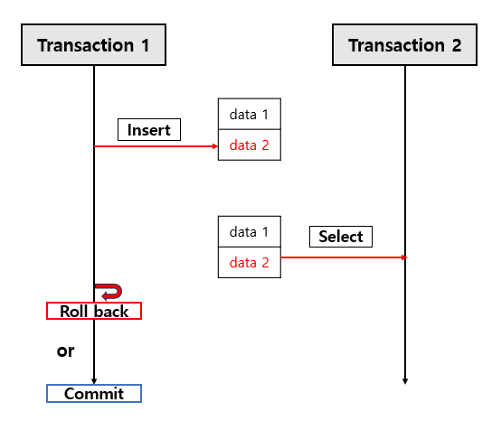
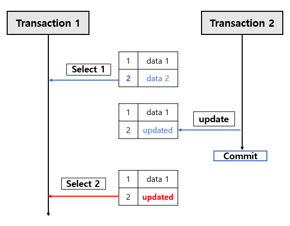
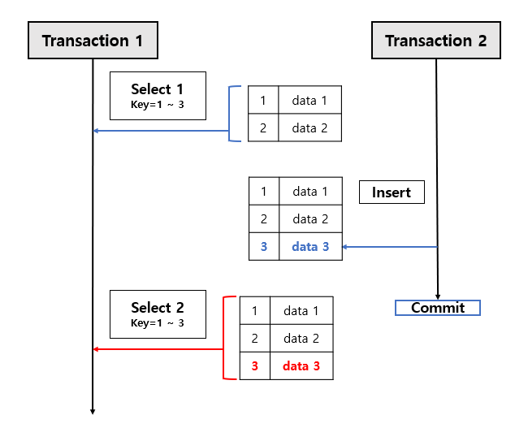

# Transaction

## Transaction이란?
- 데이터베이스의 상태를 변화시키는 하나의 논리적 작업 단위이다.
- 여러개의 SQL문이 실행되더라도 데이터베이스의 관점에서는 하나의 작업처럼 취급되어, 완전히 성공(Commit)하거나, 전혀 실행되지 않는 상태(Rollback)로 돌아가야한다.

## Transaction 특성
- 트랜잭션의 안전성을 보장하기 위해 데이터베이스는 4가지 특성(ACID)을 가진다. 

### 원자성(Atomicity)
트랜잭션 내의 모든 연산은 완전히 수행되거나, 전혀 수행되지 않아야 한다.(All or Nothing)

### 일관성(Consistency)
트랜잭션이 성공적으로 완료되면 데이터베이스는 언제나 일관된 상태를 유지해야한다.(제약 조건, 규칙 준수)

### 격리성(Isolation)
동시에 실행되는 여러 트랜잭션이 서로에게 영향을 미치지 않도록 격리되어야 한다. 

### 영속성(Durability)
성공적으로 완료된 트랜잭션의 결과는 시스템 장애가 발생하더라도 영구적으로 반영되어야 한다. 

## Transaction 격리 수준
- 트랜잭션의 격리성을 따졌을 때, 트랜잭션 수행 중간에 다른 트랜잭션이 끼어들 수 없다면? 모든 트랜잭션은 순차적으로 처리될 것이고 데이터의 정확성은 보장될 것이다. 
- 하지만 이는 동시 처리 성능을 극도로 떨어트리는 원인이 된다. 따라서 데이터베이스는 동시성과 데이터 일관성 사이의 트레이드 오프를 조절할 수 있도록 4가지 격리 수준을 제공한다.
- 격리 수준이 낮을수록 동시 처리량은 증가하지만 데어터 정합성에 문제가 발생할 확률이 높아지고, 격리 수준이 높을수록 데이터 일관성은 완벽해지지만 동시 처리 성능이 떨어진다. 

### 격리 수준 문제로 발생하는 문제점 3가지
#### Dirty Read(더티 리드) 
- 트랜잭션 A가 데이터를 수정하고 아직 커밋하지 않았는데, 트랜잭션 B가 그 수정 중인 데이터를 읽을 수 있는 현상이다. 만약 트랜잭션 A가 롤백되면 트랜잭션 B는 무효가 된 잘못된 데이터를 가지게 된다.

#### Non-Repeatable Read (반복 불가능한 조회)
- 한 트랜잭션 내에서 같은 데이터를 두 번 조회했을 때, 그 결과가 서로 다른 현상이다. 트랜잭션 A가 읽은 후 트랜잭션 B가 수정하거나 삭제하고 커밋하면 발생한다.

#### Phantom Read (팬텀 리드)
- 한 트랜잭션 내에서 동일한 조건으로 데이터를 여러 번 조회했을 때, 데이터가 나타났다가 사라지는 현상이다. 트랜잭션 A가 읽은 후 트랜잭션 B가 새로운 레코드를 삽입하고 커밋하면 발생한다.

### 4가지 격리 수준
#### READ UNCOMMITTED (LEVEL 0)
- 아직 커밋되지 않은 데이터도 다른 트랜잭션이 읽을 수 있도록 허용하는 수준이다. 
- 데이터의 일관성이 거의 지켜지지 않으므로 RDBMS에서는 일반적인 서비스 환경에서는 거의 사용하지 않는다.
- 문제점: Dirty Read, Non-Repeatable Read, Phantom Read가 모두 발생할 수 있다.

#### READ COMMITED (LEVEL 1)
- 커밋이 완료된 데이터만 다른 트랜잭션이 읽을 수 있도록 허용한다. 어떤 트랜잭션이 데이터를 수정 중이더라도 커밋 전이라면 다른 트랜잭션은 수정 전의 데이터를 조회하게 된다.(Undo 영역의 백업 데이터 활용)
- 오라클(Oracle) 등 많은 RDBMS에서 기본(Default) 격리 수준으로 사용한다.
- 문제점: Non-Repeatable Read, Phantom Read가 발생할 수 있다. 

#### REPEATABLE READ (LEVEL 2)
- 한 트랜잭션 내에서 조회된 데이터는 트랜잭션이 종료될 때까지 언제 조회되더라도 항상 동일한 결과를 보장한다. 자신의 트랜잭션 ID보다 낮은 트랜잭션 번호에서 변경된 커밋 데이터만 읽는 다중 버전 동시성 제어(MVCC) 방식을 주로 사용한다. 
- MySQL의 기본 격리 수준이다. 
- 문제점: Phantom Read가 발생할 수 있다.

#### SERIALIZABLE (LEVEL 3)
- 가장 엄격한 격리 수준으로 트랜잭션을 순차적으로 실행시킨다. 읽기 작업조차도 공유 잠금을 획득해야 하므로, 동시에 다른 트랜잭션이 해당 데이터를 절대 변경할 수 없다. 
- 동시 처리 성능이 극도로 떨어지기 때문에 극단적인 데이터 안전성이 필요한 경우가 아니라면 실무에서 거의 사용되지 않는다.
- 문제점: 동시성 문제가 전혀 발생하지 않는다. 