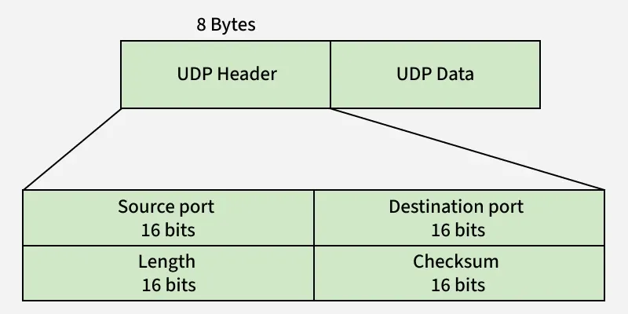

# UDP(사용자 데이터그램 프로토콜)

## UDP(User Datagram Protocol)란?
OSI 7계층 중 전송 계층(Transport Layer)에서 사용하는 프로토콜이다. TCP처럼 복잡한 연결 설정이나 신뢰성 보장 프레임워크를 거치지 않고, 데이터를 데이터그램(Datagram) 단위로 목적지에 그냥 던지는 비연결형 방식이다. 

## UDP의 핵심 특징

### 비연결형 서비스(Connectionless)
- TCP의 3-Way Handshake 같은 사전 연결 설정 과정이 없다. 
- 따라서 송신 측과 수신 측 사이에는 논리적인 전송 선로가 개설되지 않으며, 서로의 상태를 확인하지 않고 일방적으로 데이터를 전송한다.

### 신뢰성 없는 전송(Unreliable)
- 데이터가 목적지에 잘 도착했는지 확인하는 흐름 제어(Flow Control), 혼잡 제어(Congestion Control), 오류 제어(Error Control) 매커니즘이 없다. 
- 패킷이 도중에 유실되거나 순서가 뒤바뀌어 도착해도 UDP 자체적으로는 이를 해결하지 않는다. 
- 비신뢰적인 특징으로 인해 대량 데이터의 송수신은 부적절하며 주로 한 번의 패킷 송수신으로 완료되는 서비스에 많이 사용된다.

### 경량성 및 빠른 속도
- 오버헤드(기능을 수행하기 위해 추가적으로 드는 비용)가 매우 적다. 
- 연결 설정 지연이 없고 제어 메세지가 필요가 없어, 단순 전송 속도 자체는 TCP보다 훨씬 빠르다.

### 경계가 있는 서비스
- 데이터의 경계를 유지한다. 송신 측에서 100바이트 짜리 패킷 2개를 보내면 수신 측에서도 100바이트 패킷 2개로 받는다. (TCP는 데이터 스트림 형태라 경계가 없다.)

### 다대다 통신 지원
- 1:1(Unicast) 통신뿐만 아니라 1:다(Multicast), 1:전체(Broadcast) 통신이 가능하다. 

## UDP 헤더 구조

> 헤더 구조를 보면 UDP가 왜 가볍고 빠른지 알 수 있다. TCP 헤더가 기본 20바이트에 달하는 반면 UDP 헤더는 단 8바이트(64비트)로 고정되어 있다.

- **Source Port(2바이트)**: 송신 프로세스의 포트 번호
- **Destination port(2바이트)**: 수신 프로세스의 포트 번호
- **Length(2바이트)**: UDP 헤더와 데이터를 합친 전체 바이트 길이
- **Checksum(2바이트)**: 전송 중 헤더와 데이터가 변형되지 않았는지 검사하는 최소한의 오류 검출 필드(선택이지만 IPv6에서는 필수)
    - **한계**: UDP의 Checksum은 패킷이 깨졌는지만 확인하고, 깨졌다면 패킷을 그냥 버린다. 재전송을 요청하지 않기 때문에 신뢰성을 보장하지 않는다.

## UDP는 언제 사용?
신뢰성이 떨어지는데도 UDP를 사용하는 이유는 실시간성과 가벼움이 패킷 유실보다 더 중요할 때가 있기 때문이다.

- **실시간 스트리밍 및 VoIP(인터넷 전화, 화상 회의, 게임)**
  - 동영상 스트리밍이나 온라인 게임에서는 패킷이 1~2개 깨지거나 늦게 오는 것 보다, 화면이 버벅거리거나 지연되는 현상이 더 치명적이다. 화질이 살짝 깨지더라도 실시간으로 데이터를 계속 밀어주는 것이 유리하다.

- **단발성 요청/응답 서비스(DNS,DHCP)**
  - 도메인 주소를 IP로 바꾸는 DNS 요청은 단 한 번의 패킷 교환으로 끝난다. 이러한 간단한 작업에는 TCP 연결을 맺고 끊는 과정(Handshake)를 거치는 것보다 UDP를 사용한다.

- **멀티 캐스트/브로드캐스가 필요한 서비스**
  - 네트워크 상의 여러 컴퓨터에 동시에 같은 데이터를 뿌려야 할 때 사용한다. 